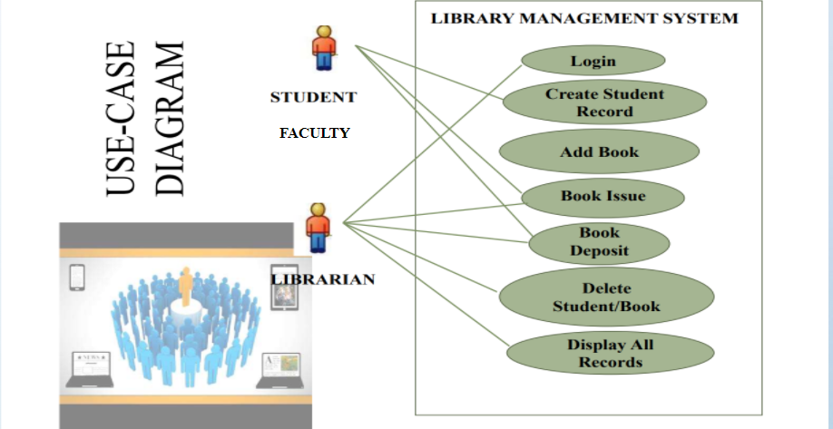
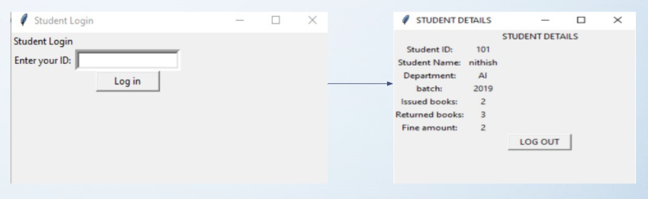
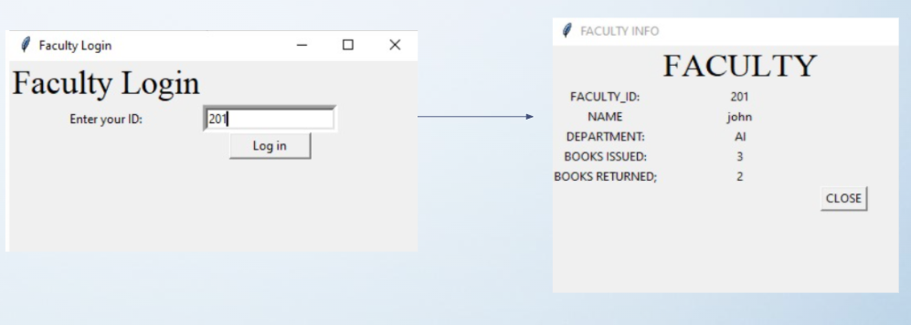
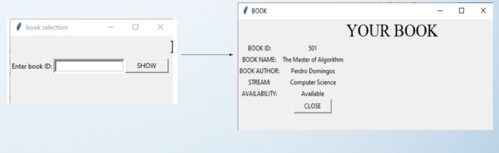
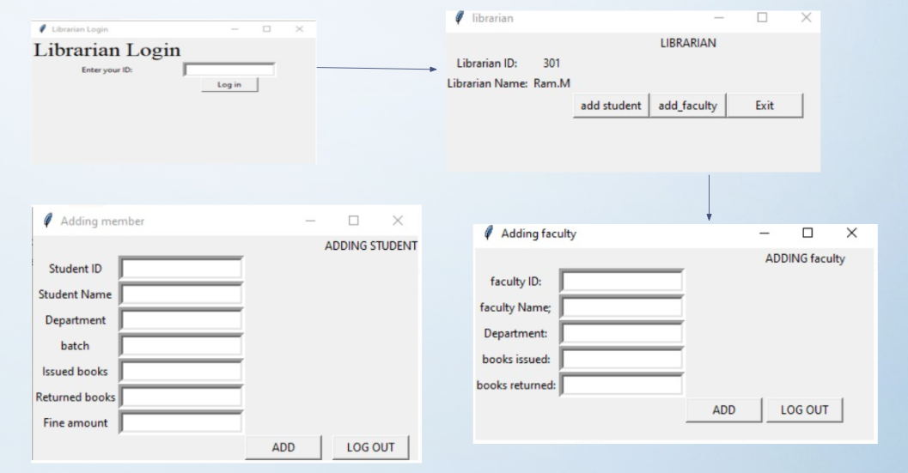

# Read-Me-Up
Library Management System

“Library Management ”, which mainly focuses on basic operations in a library like adding new books, searching books and members and return books.

We can issue the books to the students, maintain their records, check how many books are issued and stock available .

Outline of the Project

 

User interface 

